# More Bugs

## Intrinsic Errors
### Business Error
Project: alibaba/fastjson Fastjson is a Java library that can be used to convert Java Objects into their JSON representation. It can also be used to convert a JSON string to an equivalent Java object

BIC: 12fd92fb1c41e5b9aa6ec4455d8802911e179052

BIC aims to add support of parsing fieldname like "message_id", which contains _ (not only as prefix). It removes all of _.

Consider a json string that contains both "message_id" and "messageid".  After removing _, these two fieldnames have no difference. This case is a typical Business Error.

### Unchecked Null
Project: google/gson A Java serialization/deserialization library to convert Java Objects into JSON and back

BIC: 23e2916947940864f828505531aa130fba6d8743

returned nullsafe(), but ignore the case that typeAdapter is null by itself.

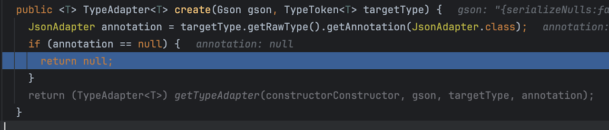
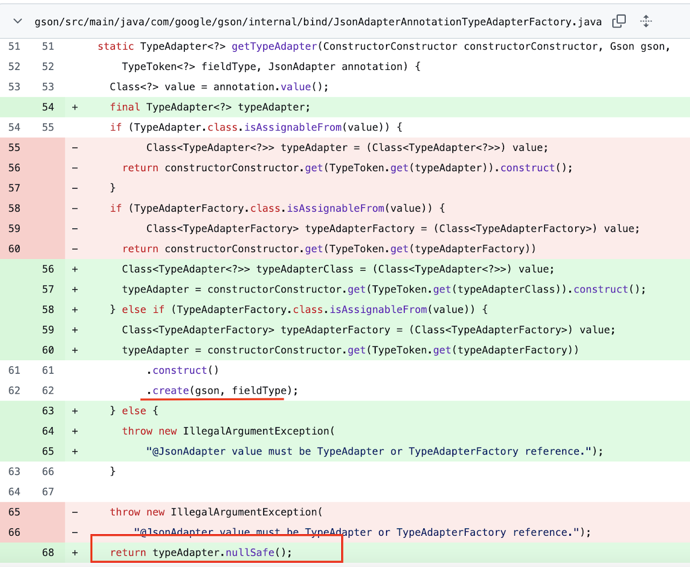
typeAdapter is null!

### API Misuse
DiUS/java-faker: Brings the popular ruby faker gem to Java

BIC: e1151d6cca4920cb7c3bbc38011baa3de609c7fc 

BIC: The BIC generates random numbers using the BigDecimal class, but due to the developer's misunderstanding of the behavior of BigDecimal.longValue() (which directly truncates the decimal part without a rounding rule), the generated random numbers fail to reach the upper boundary.

(For example, 1.9 --> 1)

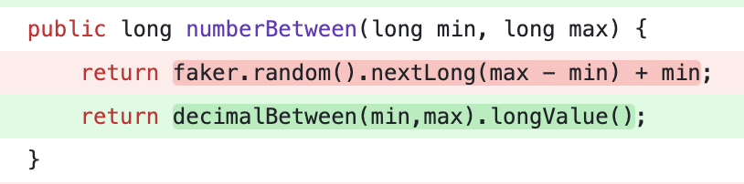
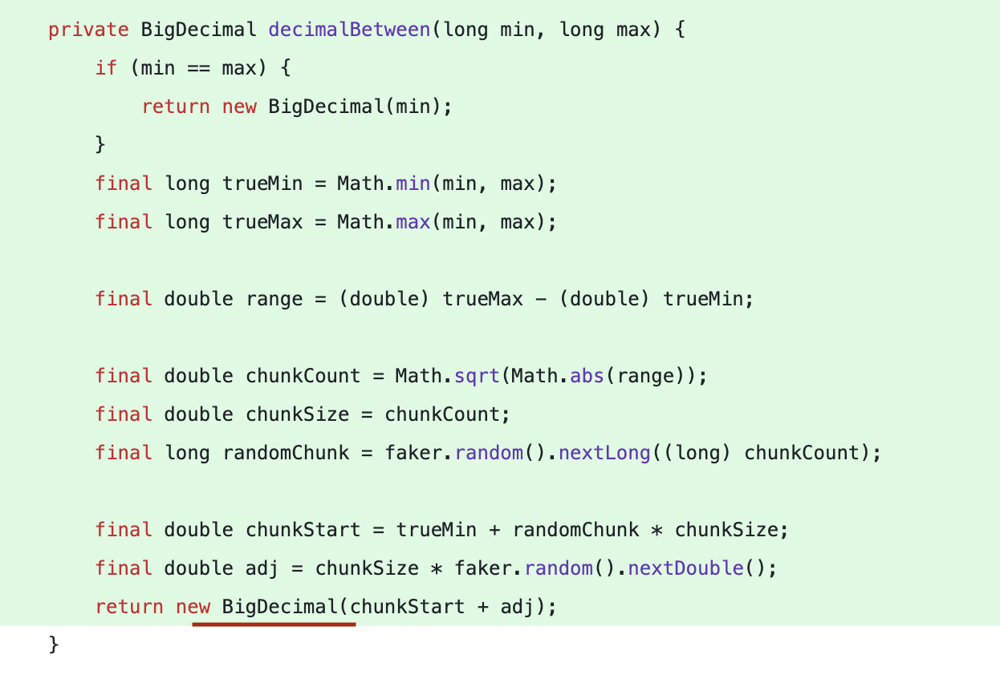
Testcase that triggers the bug:
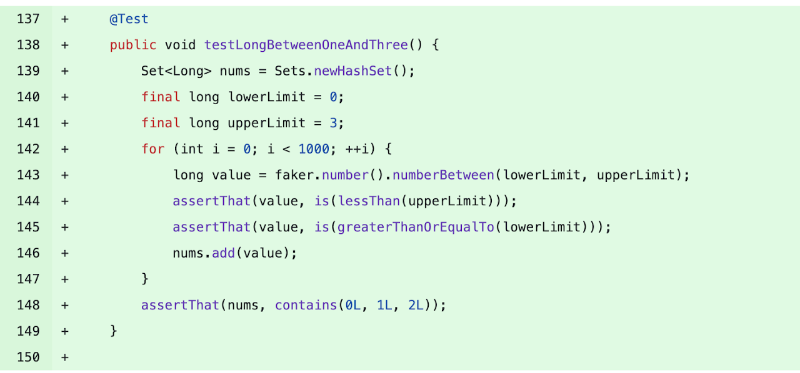
BIC Error Message:
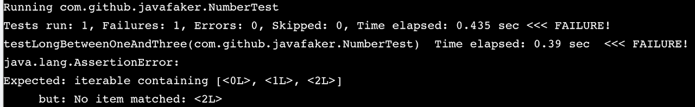

## Compatibility Errors
### Data Flow incompatibility
mrniko/netty-socketio: Socket.IO server implemented on Java. Realtime java framework

BIC: e693aaf36b9df00adb78d1698987b7dea2dd9679 

BIC: The BIC changed the default value of args in the Packet class from null to Collections.emptyList(), leading to an incompatibility with the encoding logic in the Encoder class. According to the specification, if args is empty, the encoded result should omit the args field rather than include an empty list. Due to this incompatibility, the Encoder generated "args":[], causing the test to fail.

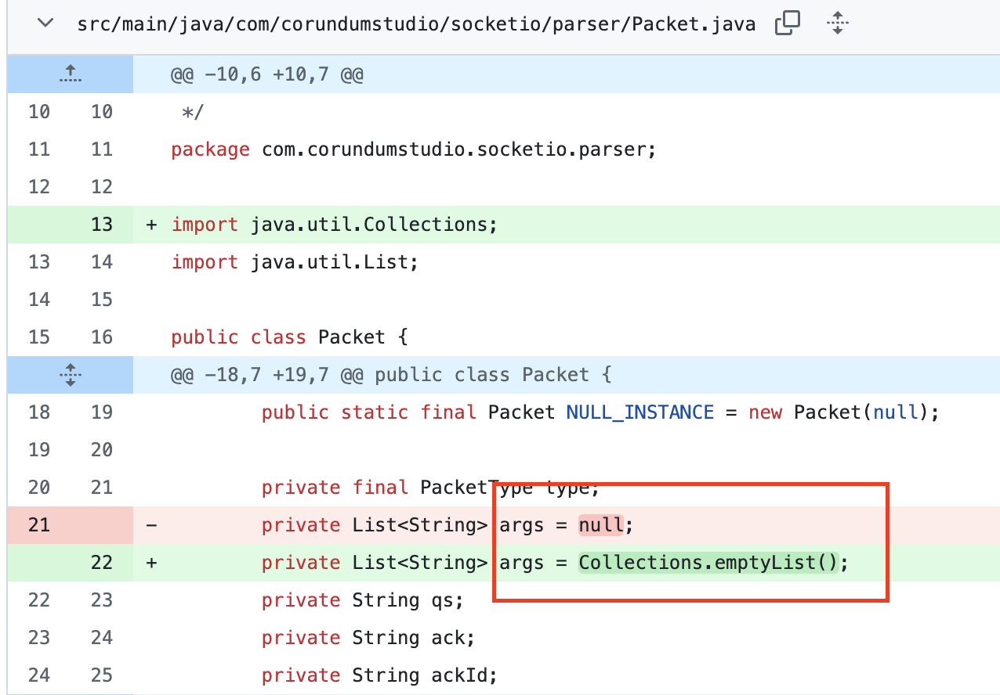
Testcase that triggers the bug:
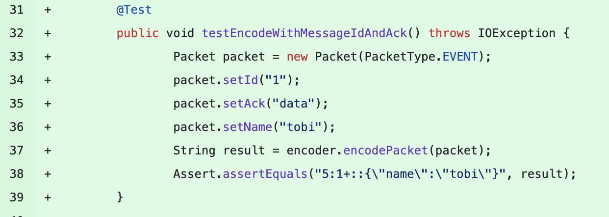
BIC Error Message:
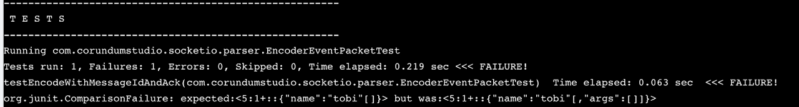

### Invocation incompatibility:

yegor256/cactoos:  Object-Oriented Java primitives, as an alternative to Google Guava and Apache Commons

BIC: 7d703932682ab2094f62f45588b7db9fcd15acea

BIC overrides close() method of WriterAsOutputStream, which closes the writer(java.io.Writer). 
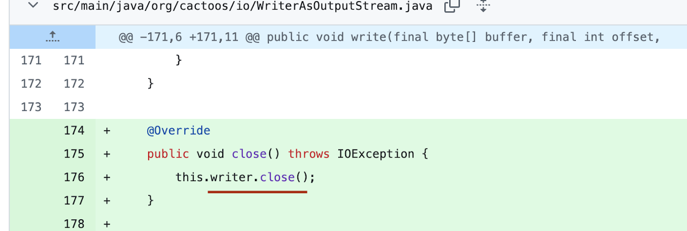
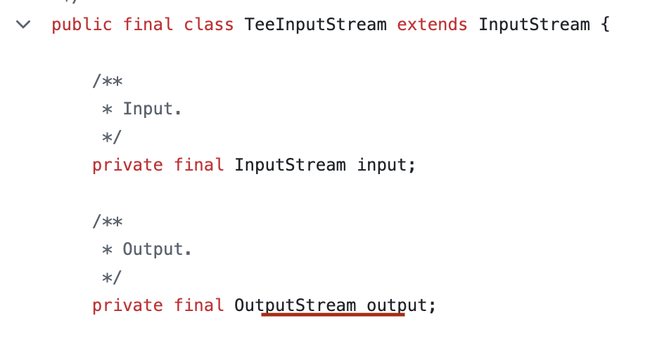
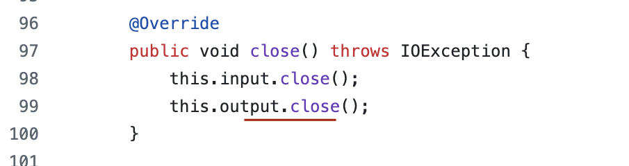
close() of TeeInputStream called its output.close(), which is the close() in WriterAsOutputStream.

Before BIC, the close() of WriterAsOutputStream is inherited from java.io.OutputStream, which will not close the writer within WriterAsOutputStream.

It is a correct logic that close() in WriterAsOutputStream will close its writer. However, this causes the writer is closed incorrectly (for the view of TeeInputStream). This is a typical incompatibility with direct caller-callee relationship.