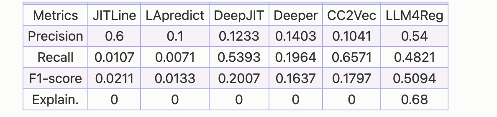
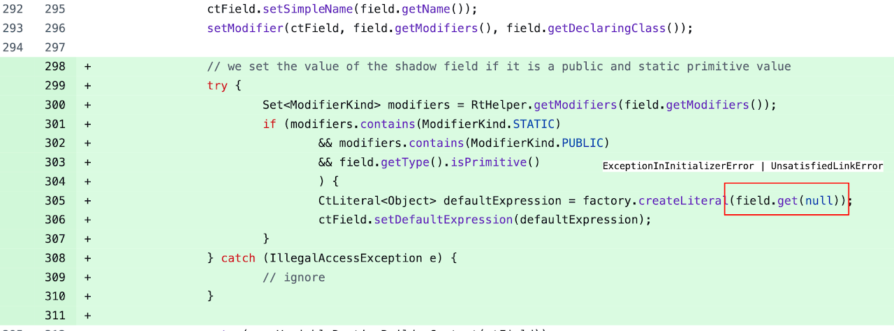
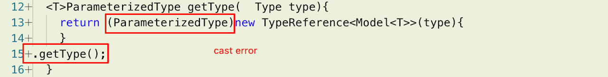

# Characterizing Regression Bug‑Inducing Changes and Improving LLM‑Based RegressionBug Detection
Repository for the paper "Characterizing Regression Bug‑Inducing Changes and Improving LLM‑Based RegressionBug Detection" (ICSE 2026). Keep updating 

* [Traditional JIT-DP Technology Mentioned in Author’s Response](#traditional-jit-dp-technology-mentioned-in-authors-response)
* [Replication Package](#replication-package)
* [Change Impact Analysis and Co-changed Files Top-k Setting](#change-impact-analysis-and-co-changed-files-top-k-setting)
* [280 Manually Analyzed Regression Bugs](#280-manually-analyzed-regression-bugs)
* [Project Details for 280 Bugs](#project-details-for-280-bugs)
* [Bug Examples(RQ3): Cast Errors and Uncaught Exceptions](#bug-examplesrq3-cast-errors-and-uncaught-exceptions)
* [More Bugs](#more-bugs)

## Traditional JIT-DP Technology Mentioned in Author’s Response
**JITLine** [1] combines expert features and token features with Random Forest (RF) classification technique for JIT-DP and JIT-DL.

**LApredict** [2] adopts the added-line-number feature within expert features and builds a Logistic Regression (LR) classifier to perform JIT-DP.

**DeepJIT** [3] automatically extracts interactive semantic features from commit messages and code changes, then combines them with Convolutional Neural Network (CNN) for JIT-DP.

**Deeper** [4] extracts expert features using Deep Belief Network and builds a logistic regression classifier to perform JIT-DP.

**CC2Vec** [5] is a neural network model that captures the semantic intent of code changes and models the hierarchical structure by attention mechanism. CC2Vec learns vector representations of code changes for JIT-DP.

[1] Chanathip Pornprasit and Chakkrit Tantithamthavorn. 2021. JITLine: A Simpler, Better, Faster, Finer-grained Just-In-Time Defect Prediction. In 18th IEEE/ACM International Conference on Mining Software Repositories, MSR 2021, Madrid, Spain, May 17-19, 2021. IEEE, 369–379. doi:10.1109/MSR52588.2021.00049

[2] Zhengran Zeng, Yuqun Zhang, Haotian Zhang, and Lingming Zhang. 2021. Deep just-in-time defect prediction: howar are we?. In ISSTA ’21: 30th ACM SIGSOFT International Symposium on Software Testing and Analysis, Virtual Event,Denmark, July 11-17, 2021, Cristian Cadar and Xiangyu Zhang (Eds.). ACM, 427–438. https://doi.org/10.1145/3460319.3464819

[3] Thong Hoang, Hoa Khanh Dam, Yasutaka Kamei, David Lo, and Naoyasu Ubayashi. 2019. DeepJIT: an end-to-end deep learning framework for just-in-time defect prediction. In Proceedings of the 16th International Conference on Mining Software Repositories, MSR 2019, 26-27 May 2019, Montreal, Canada, Margaret-Anne D. Storey, Bram Adams, and Sonia Haiduc (Eds.). IEEE / ACM, 34–45. https://doi.org/10.1109/MSR.2019.00016

[4] Xinli Yang, David Lo, Xin Xia, Yun Zhang, and Jianling Sun. 2015. Deep Learning for Just-in-Time Defect Prediction. In 2015 IEEE International Conference on Software Quality, Reliability and Security, QRS 2015, Vancouver, BC, Canada, August 3-5, 2015. IEEE, 17–26. https://doi.org/10.1109/QRS.2015.14

[5] Thong Hoang, Hong Jin Kang, David Lo, and Julia Lawall. 2020. CC2Vec: distributed representations of code changes. In ICSE ’20: 42nd International Conference on Software Engineering, Seoul, South Korea, 27 June - 19 July, 2020, Gregg Rothermel and Doo-Hwan Bae (Eds.). ACM, 518–529. https://doi.org/10.1145/3377811.3380361

## Replication Package
Our code and data are available in [replicationpackage.zip](https://drive.google.com/file/d/1JMyja_OpdrNKV9epnKTzCRCEidW0kEAi/view).

## Change Impact Analysis and Co-changed Files Top-k Setting
In order to fairly select the optimal Top-k values for the change impact methods and co-changed files, we conducted a series of experiments focusing on the parameter k. Through these experiments, we aimed to observe the impact of varying k on both change impact methods and co-changed files analysis, ultimately identifying the best value for k. Below are the experimental results for various k values, showcasing the variations in Precision, Recall, F1-score, and Explanation Accuracy.

Impact methods only varying k:

| k | Precision | Recall | F1-score | Explanation Acc. |
| :---: | :---: | :---: | :---: | :---: |
| 1 | 0.4424 | 0.3429 | 0.3863 | 0.4792 |
| 3 | 0.4750 | 0.4071 | 0.4384 | 0.5439 |
| 5 | 0.4868 | 0.4642 | 0.4752 | 0.6279 |
| 7 | 0.5118 | 0.4643 | 0.4869 | 0.6385 |
| 10 | 0.4800 | 0.4464 | 0.4626 | 0.5920 |
| 15 | 0.4615 | 0.4286 | 0.4444 | 0.5583 |
| 20 | 0.4219 | 0.3857 | 0.4030 | 0.4907 |

  

Co-changed files only varying k:

| k | Precision | Recall | F1-score | Explanation Acc. |
| :---: | :---: | :---: | :---: | :---: |
| 1 | 0.3750 | 0.3214 | 0.3461 | 0.4222 |
| 2 | 0.4286 | 0.3750 | 0.4000 | 0.4857 |
| 3 | 0.4545 | 0.4107 | 0.4315 | 0.5217 |
| 5 | 0.4400 | 0.3929 | 0.4151 | 0.5091 |
| 7 | 0.4000 | 0.3571 | 0.3773 | 0.4500 |
| 10 | 0.3514 | 0.3250 | 0.3377 | 0.3956 |

  
Based on the experimental results, in the experiments of the paper, we set the Top-k values for the change impact methods and co-changed files for LLM4Reg to k=7 and k=3 respectively.

## 280 Manually Analyzed Regression Bugs
You can find in [Detailsof280RegressionBugs.csv](./Detailsof280RegressionBugs.csv).

## Project Details for 280 Bugs

You can find in [ProjectDetailsFor280Bugs.csv](./ProjectDetailsFor280Bugs.csv), and you can access all of these projects in Github.

## Bug Examples(RQ3): Cast Errors and Uncaught Exceptions

#### Uncaught Exception (RQ3, 5.2, Code-Level Root Cause): 

Project: INRIA/spoon: a metaprogramming library to analyze and transform Java source code.

BIC: 91f9fbdcecce19f3b70ca82c7deef39f900075ae

The code changes in BIC hopes to enhance the processing of shadow fields during code parsing. However, field.get(null) introduces unhandled exceptions `ExceptionInInitializerError` and `UnsatisfiedLinkError`.

Note that this bug can hardly be detected without the context of changes. First, the specific type of `field` is unknown. In addition, the method declaration of `field.get(xx)` is also unknown, making it difficult to infer the exceptions it throws.

#### Cast Error (RQ3, 5.2, Code-Level Root Cause):

Project: alibaba/fastjson: a Java library that can be used to convert Java Objects into their JSON representation

BIC: ef50a5b756a6cab1ab753f4a661bdfb0ccbd6b7e

The code changes hope to enhance `TypeReference` performance. However, the returned value has changed to cachedType and is no longer `ParameterizedType`rq3-cast-error-2, resulting in a type cast error.

While it is known that the initialization code of `TypeReference` has changed, the declaration and partial assignment of the new return value `cacheType` are outside the changed code. Even though it can be understood from the changed code that the declaration `cachedType` is `Type`, the type relationship between `Type` and `ParameterizedType` is not clear.

## More Bugs
You can find more bug examples in [MoreBugs.md](./MoreBugs.md).